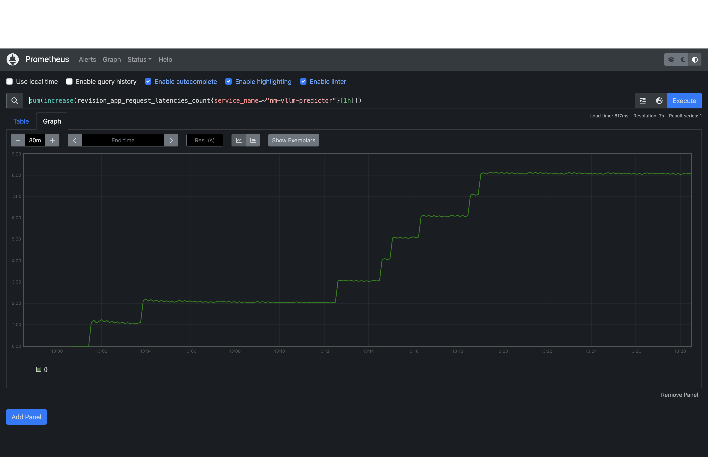
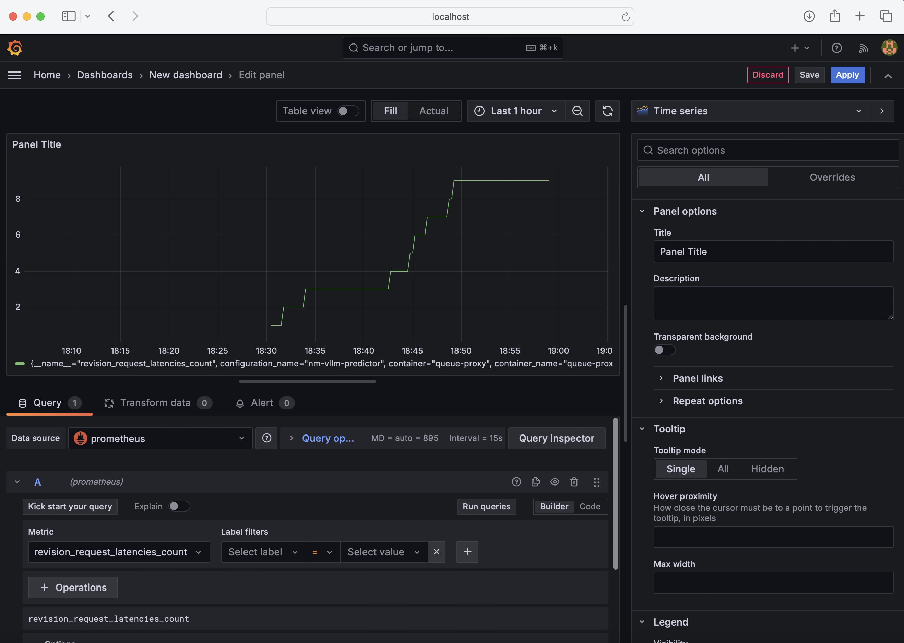

# WikiSpeaks - A Scalable RAG-based Wikipedia Assistant

A highly scalable chat assistant that provides real-time Wikipedia information using the `Llama-2-7b-chat` LLM, inferenced
with Kserve for high concurrency, monitored using Prometheus and implemented on a user-friendly Streamlit interface

## Table of Contents

+ [Architecture Overview](#architecture-overview)
    + [Model Inferencing](#1-model-inferencing)
    + [Application](#2-application)
    + [Monitoring](#3-monitoring)
+ [Demo](#demo)
+ [Prerequisites](#prerequisites)
+ [Setup](#setup)
    + [KServe](#kserve)
        + [Installation](#installation)
        + [InferenceService](#check-inferenceservice-status)
        + [Inference Request](#perform-model-inference)
    + [Application](#application)
        + [Local Deployment](#a-local-deployment)
        + [Docker Deployment](#b-docker-deployment)
        + [Kubernetes Deployment](#c-kubernetes-deployment)
+ [Monitoring](#monitoring)


## Architecture Overview

This Project consists of 3 main components - 

### 1. Model Inferencing

The `llama-2-7b-chat-hf` model is inferenced using KServe, a standard, cloud agnostic Model Inference Platform on Kubernetes.

### 2. Application

- **Data Source**: The Wikipedia python library scrapes text data from Wikipedia Pages based on the user's question.

- **Vector Database**: The data from Wikipedia is stored as a FAISS index with the help of Ray, significantly improving the speed of generating and persisting vector embeddings 

- **Prompt**: By utilizing the Langchain wrapper for OpenAI chat completion models, we can infer the hosted Llama model in our Retrieval Augmented Generation (RAG) approach -- using the context from the stored FAISS index and the user's question.

### 3. Monitoring
To enable prometheus metrics, add the annotation `serving.kserve.io/enable-prometheus-scraping` to the InferenceService YAML. With the exported metrics (inference latency, explain request latency etc.), they can now be visualised on Grafana.

## Demo

<div align = "center">
<kbd>

</kbd>
</div>

## Prerequisites

- Kubernetes Cluster (recommend 16 cpu x 64 Gb RAM x 1 Nvidia GPU per worker node )
- Python 3.9+

## Setup
### 1. KServe

### **Installation**

Install KServe on your cluster using the KServe Quick installation script - 

```
curl -s "https://raw.githubusercontent.com/kserve/kserve/release-0.13/hack/quick_install.sh" | bash
```

Ensure you accept the terms and conditions of the `llama-2-7b-chat-hf` repository on huggingface in order to use the LLM. Once you have the required permissions, copy paste the API Key into a Kubernetes Secret - 

```
export HF_TOKEN={your_token}
kubectl create secret generic hf-token --from-literal=hf-token="$HF_TOKEN"
```

Now deploy the the Llama 2 Chat model by deploying the InferenceService resource on your cluster -

```
kubectl apply -f deployments/kserve-llama.yaml
```

Note - The KServe HuggingFace runtime by default uses vLLM to serve the LLM models for faster time-to-first-token(TTFT) and higher token generation throughput. If the model is not supported by vLLM, KServe falls back to HuggingFace backend as a failsafe.


### **Check InferenceService status**

```
kubectl get inferenceservices huggingface-llama2
```

Wait for ~ 5 - 10 minutes, you should see the status `READY=TRUE`


### **Perform Model Inference**

In order to check if you can inference successfully we shall perform a sample inference using OpenAI's `/v1/completions` endpoint.

```
export INGRESS_PORT=$(kubectl -n istio-system get service istio-ingressgateway -o jsonpath='{.spec.ports[?(@.name=="http2")].port}')
export INGRESS_HOST=$(kubectl -n istio-system get service istio-ingressgateway -o jsonpath='{.status.loadBalancer.ingress[0].hostname}')
export SERVICE_HOSTNAME=$(kubectl get inferenceservice huggingface-llama2 -o jsonpath='{.status.url}' | cut -d "/" -f 3)
```

```
curl -v http://${INGRESS_HOST}:${INGRESS_PORT}/openai/v1/completions \
-H "content-type: application/json" -H "Host: ${SERVICE_HOSTNAME}" \
-d '{"model": "meta-llama/Llama-2-7b-chat-hf", "prompt": "Who is the president of the United States?", "stream":false, "max_tokens": 30}'
```

Your model is now ready for use!

### 2. Application

For the application, a Streamlit frontend provides a nice, interactive interface for users to input their questions and receive informative answers — you don't have to scour through Wikipedia pages anymore!


### **a. Local Deployment**

To deploy the application locally - 

1. Create a local python environment - 

```
python -m venv env
source /env/bin/activate
```

2. Install the required dependencies for the project - 

```
pip install -r requirements.txt
```

3. Run streamlit - 

```
/env/bin/streamlit run app.py
```


### **b. Docker Deployment**

A Dockerfile is provided to build your own image of the application, to do so run -

```
docker build -t wikispeaks:v1 .
```

To start the application run - 

```
docker run -p 8080:8051 -e INGRESS_HOST=$INGRESS_HOST -e INGRESS_PORT=$INGRESS_PORT -e SERVICE_HOSTNAME=$SERVICE_HOSTNAME wikispeaks:v1
```

Run the application on localhost:8080 on your web browser.


### **c. Kubernetes Deployment**

A Kubernetes deployment file is provided to host your application on a K8s cluster -

```
kubectl apply -f deployments/app-deployment.yaml
```

**Note:** Please ensure to update the values of the environment variables in the secret before applying the deployment.

Ensure the deployment, pods and service are all up and running

```
kubectl get deployment wiki-app-deployment
kubectl get pod | grep wiki-app
kubectl get svc wiki-service
```

Access the application using the external IP of the load balancer service on your web browser!


## Monitoring

Prometheus and Grafana are used to monitor the performance of the deployed model and application. For this application, I've just visualised the inferencing latency, but there are many [other](https://kserve.github.io/website/latest/modelserving/observability/prometheus_metrics/) metrics than can be visualised.

### 1. Enable Prometheus Metrics

On adding the `serving.kserve.io/enable-prometheus-scraping: "true"` annotation to the InferenceService YAML, the kserve container exports it's custom metrics to the prometheus server, which can be visualised on a Grafana Dashboard.

### 2. Setup Prometheus

Follow the Kserve [guide](https://github.com/kserve/kserve/tree/master/docs/samples/metrics-and-monitoring) to setup Prometheus using the Prometheus Operator

Once setup, to access the scraped metrics, port forward the Prometheus Service - 

```
kubectl port-forward service/prometheus-operated -n kfserving-monitoring 9090:9090
```

To measure the model requests, inference the llama model from the application, the request latency metric can be captured on prometheus as shown below - 

<div align = "center">
<kbd>

</kbd>
</div>


### 3. Setup Grafana

The captured prometheus metrics can be visualised better on Grafana, follow the Grafana installation [guide](https://grafana.com/docs/grafana/latest/setup-grafana/installation/kubernetes/) to install and configure Grafana on your Kubernetes cluster

Open the Grafana dashboard by port-forwarding the service - 

```
kubectl port-forward service/grafana 3000:3000 --namespace=my-grafana
```

Add Prometheus as a data-source and ensure you utilise the external IP of the prometheus service!

You can then visualise a bunch of metrics scraped by Prometheus, exported from kserve.

<div align = "center">
<kbd>

</kbd>
</div>


## Contributions

Any contributions are welcome! Please raise an issue or PR, and I'll address them as soon as possible!

## Future Work

- Ray Operator 
- Custom Kserve model deployment